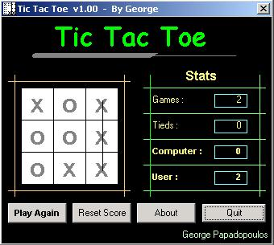



## A Nice Tic Tac Toe  Game

### Description

A great game...it has a very good engine and scores ..demonstrates how to use arrays,sub,function,grafics...I Know its a Bit Difficult to read but Have Fun anyway :)
 
### More Info
 

             |
---                |---
**Submitted On**   |2001-01-06 06:13:10
**By**             |[George Papadopoulos  \- VirusFree](https://github.com/Planet-Source-Code/PSCIndex/blob/master/ByAuthor/george-papadopoulos-virusfree.md)
**Level**          |Intermediate
**User Rating**    |4.3 (26 globes from 6 users)
**Compatibility**  |VB 5\.0, VB 6\.0
**Category**       |[Games](https://github.com/Planet-Source-Code/PSCIndex/blob/master/ByCategory/games__1-38.md)
**World**          |[Visual Basic](https://github.com/Planet-Source-Code/PSCIndex/blob/master/ByWorld/visual-basic.md)
**Archive File**   |[A\_Nice\_Tic966496192002\.zip](https://github.com/Planet-Source-Code/george-papadopoulos-virusfree-a-nice-tic-tac-toe-game__1-36044/archive/master.zip)

